# Introduction to Amazon DynamoDB 
---
## Overview

Amazon DynamoDB is a fully managed NoSQL database service that provides fast and predictable performance with seamless scalability. You can use Amazon DynamoDB to create a database table that can store and retrieve any amount of data, and serve any level of request traffic. Amazon DynamoDB automatically spreads the data and traffic for the table over a sufficient number of servers to handle the request capacity specified by the customer and the amount of data stored, while maintaining consistent and fast performance

### Core Components

1. **Tables**:
    -  Each table is a collection of items, similar to a table in a relational database.
    - Tables in DynamoDB are schema-less, meaning each item in the table can have different attributes, and attributes can vary in type.
    - Tables are organized based on primary keys, which uniquely identify each item in the table.
2. **Items**:
    - Items are individual records stored within a DynamoDB table. They represent a single data record or entity.
    - Each item consists of one or more attributes, which are the data fields or properties associated with the item.
    - Items can have different attributes, and there is no fixed schema for items within a table.
3. **Attributes:**
    - Attributes are the individual data fields or properties of an item in a DynamoDB table.
    - Each attribute has a name and a value. Attributes can be of various data types, including string, number, binary, Boolean, list, or map.
    - Attributes can be indexed for efficient querying and retrieval of data.
4. **Primary Keys:**
    - Every item in a DynamoDB table must have a primary key, which uniquely identifies the item within the table.
    - DynamoDB supports two types of primary keys:
        * Partition Key: A single attribute that uniquely identifies each item in the table. 
        * Composite Key: A combination of two attributes: a partition key (hash key) and a sort key (range key). Together, they uniquely identify each item in the table.

## Key Learnings:

- Understanding Amazon DynamoDB as a fully managed NoSQL database service.
- Learning about core components like tables, items, attributes, and primary keys.
- Exploring table creation, adding items, querying, and exploring DynamoDB with PartiQL queries.
- Exploring advanced features like backups, exporting data to Amazon S3
- Learning about table configurations, including indexes, monitoring, and global tables.
- Understanding various  table operations like item modification, deletion, and table deletion.

---

# Getting started with AWS DynamoDB
---
**Lab Duration : 1 hour**

Follow the Steps below to start with the lab

***Step1**: Signing In to the console*
1. Open the browser and navigate to [AWS Management Console](https://console.aws.amazon.com/).

2. Provide the credentials **AccountId, Username, Password**
3. **SignIn link, Username and Password** are available in the Environment Tab of cloud Labs

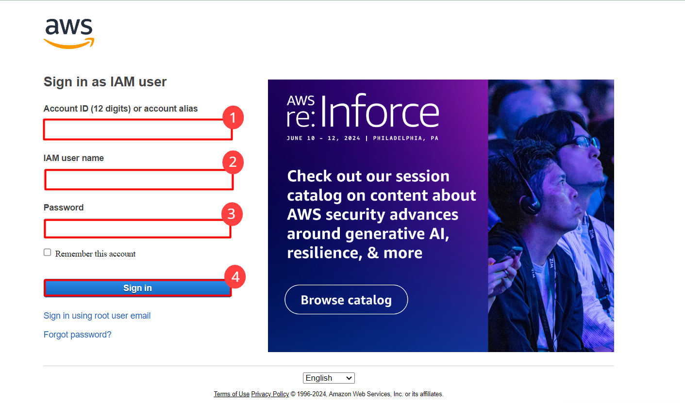
***Step 2**: Region Selection and Navigate to the DynamoDB service*
1.  Once login is succesfull you will be directed to the aws console
2.  Choose the desired region from the drop down menu where you intend to utilize the service.
    You can utilize the service in any of the following regions:
    * us-east-1
    * us-east-2
    * us-west-1
    * us-west-2
    * ap-south-1 

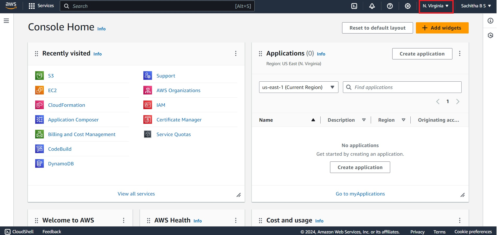 

3. In the search bar,search for the service by typing its name and click on the service from the result section

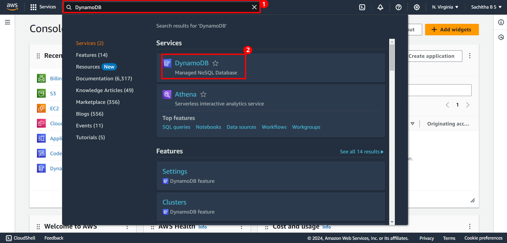 

---

# **Exercise 1: Table Creation**
---
1. Once the Service is located you will be directed to the **DynamoDB** Homepage
2. In order to create Table click on **Create Table** as shown below

 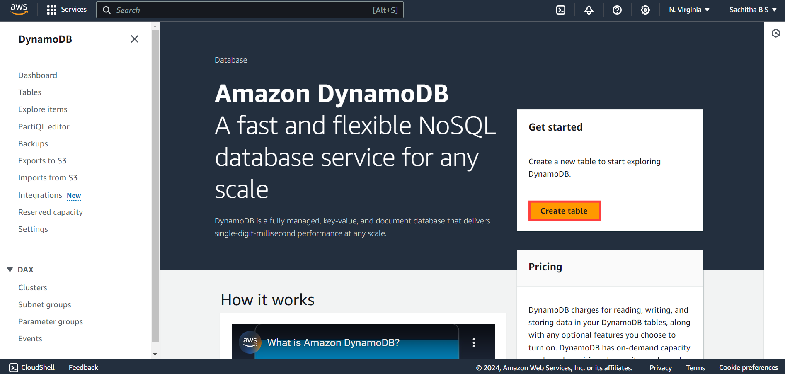 

3. Specify the table details for creating the table. Enter the table name

 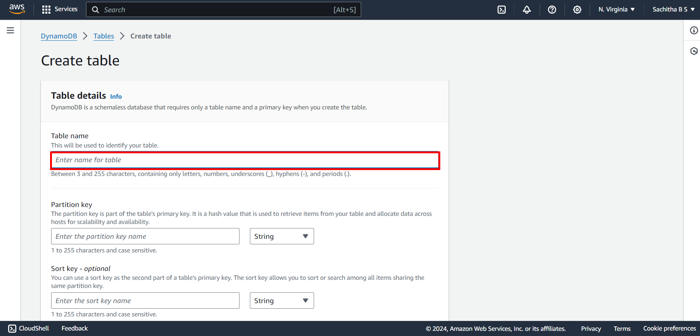 

4. Provide the partition key Name and its corresponding type .Type can be selected through the drop down 

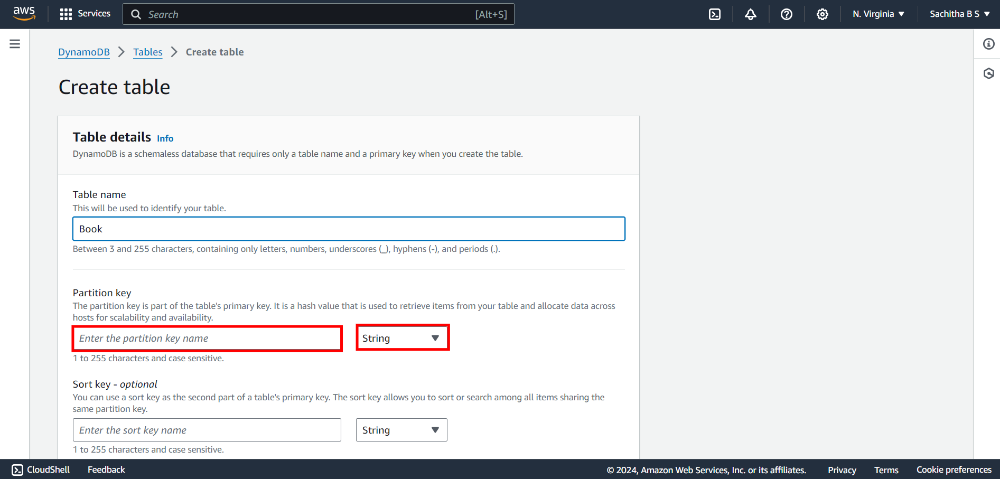 

5. Sort Key can also be utilized for creating primary key .But its optional unless you know the data in the partition key is not repeated. Provide the Sort key name and its corresponding type.

 

6. Under **Table Setting** Keep the default Settings

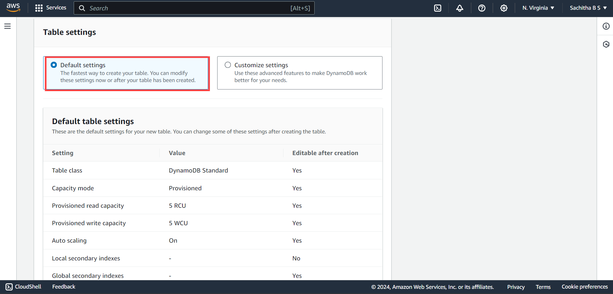 

7. After Specifying the details, Scroll down and click on **Create Table**

 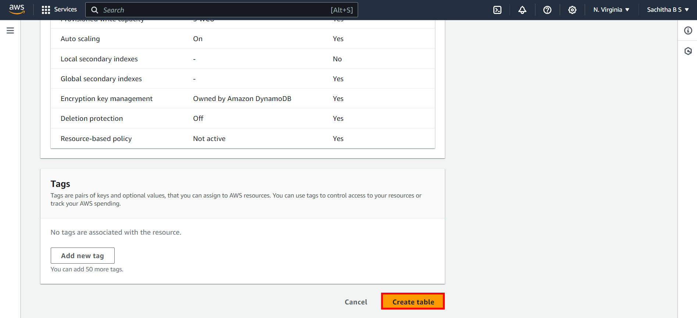

# **Exercise 2: Adding Items to the created table**
---
1. Once you have created the table you get to see that the table has been created and all its configurations can be seen as below

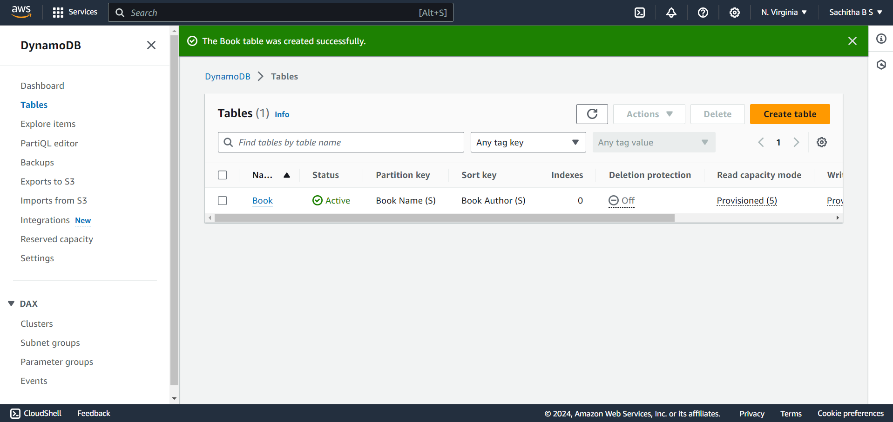

2. To Add the item ,Click on **Explore items** in the left navigation pane of console

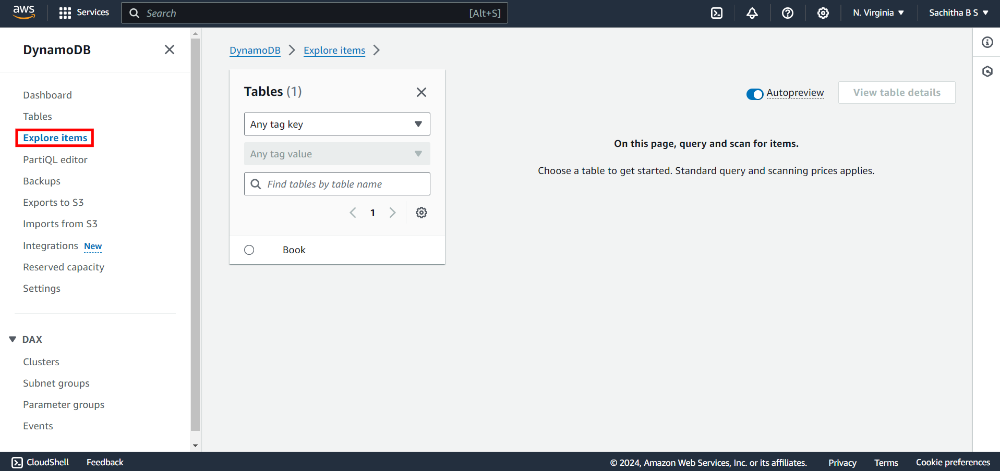

3. On the **Tables Page**, Select the table created

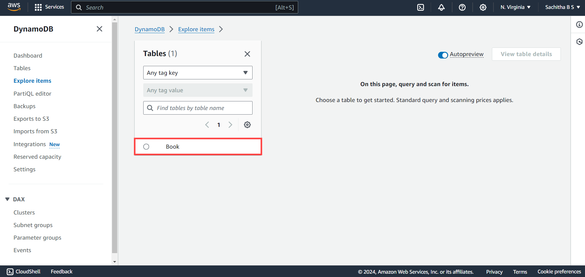

4. In the **Items Returned Page**, Click on **Create Item**

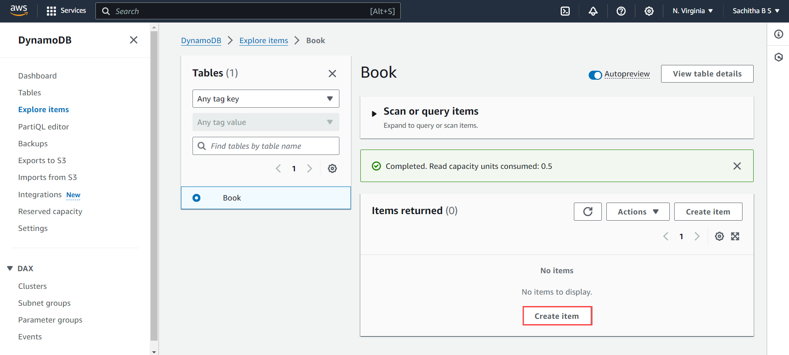

5. You are now redirected to **Create Item** page, Enter the Attribute Values based on the type.
    - Book Name
    - Book Author

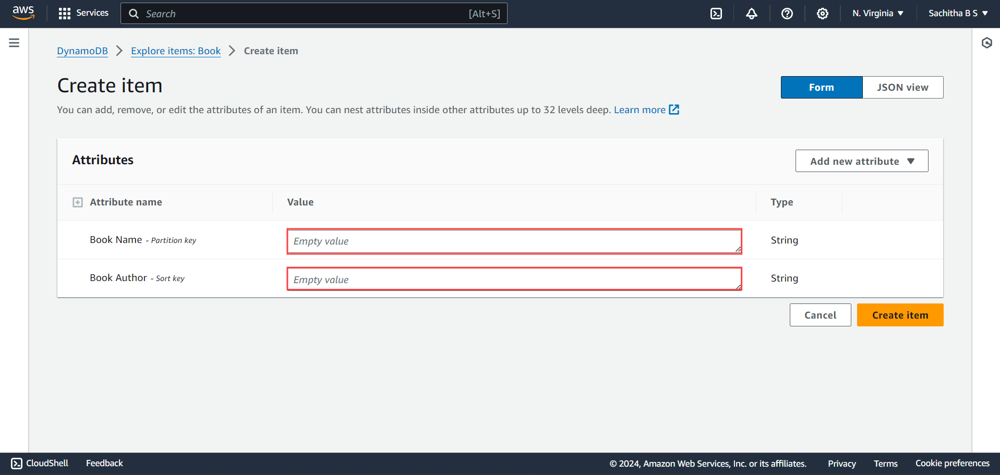

6. To add Additional Attribute apart from the Existing Attribute, Click on **Add New Item** where you need to first select the type of the attribute

7. Enter the Attribute name and its Type. Repeat the process to add more attribute as mentioned in **Step 6** 

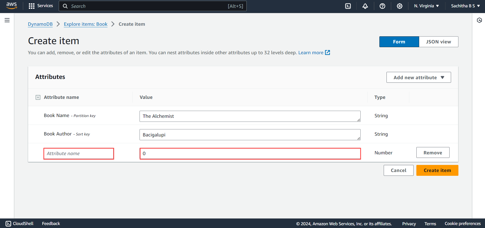

8. Click on **Create Item** for adding the item into the table.

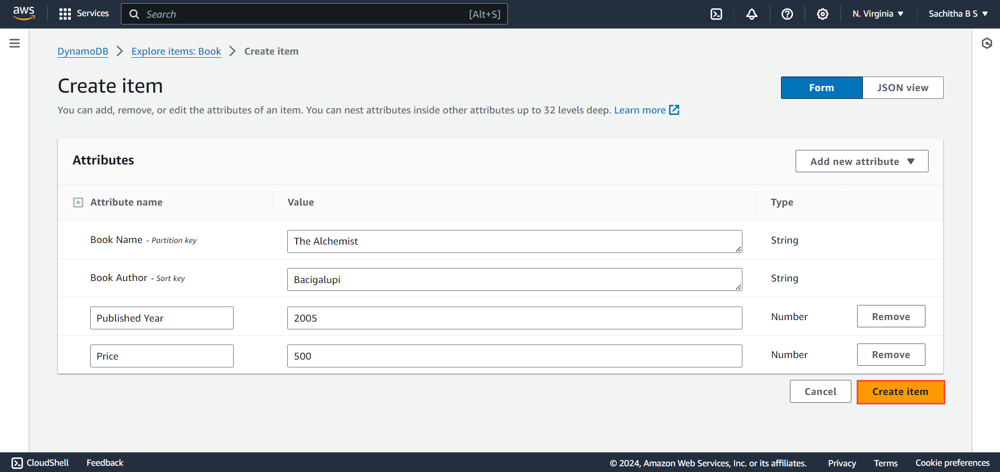

9. In **Items Returned** page one item will be inserted. To add additional items click on **Create Item** and Repeat the procedure.

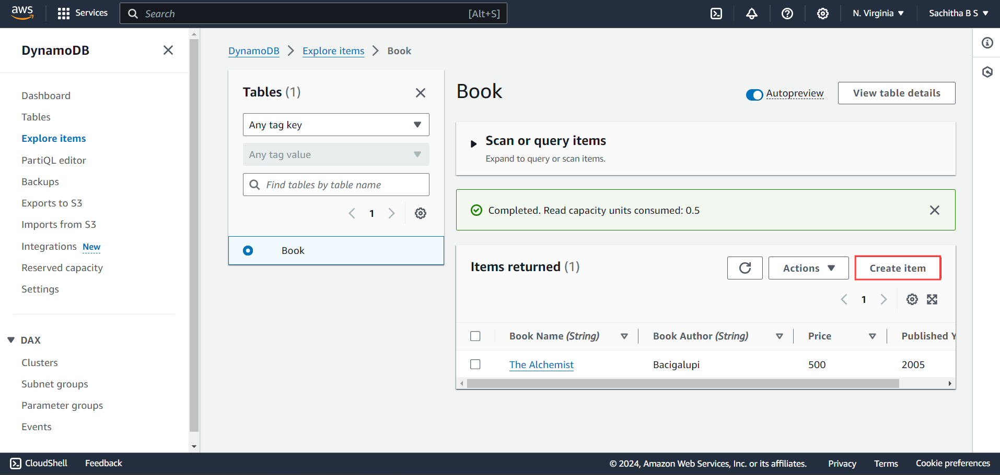
