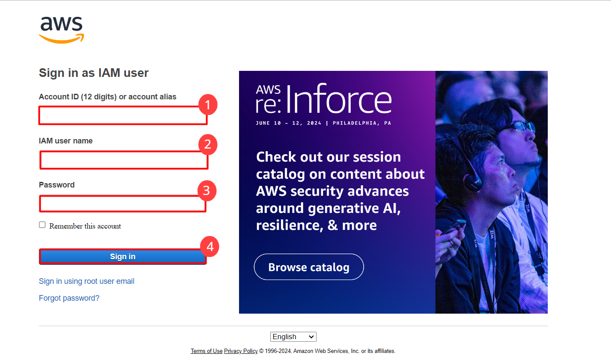
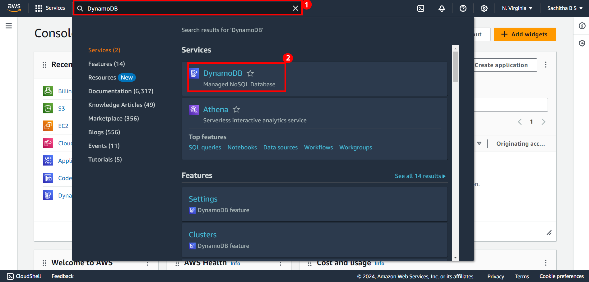

# Getting started with AWS DynamoDB
---
**Lab Duration : 1 hour**

Follow the Steps below to start with the lab

***Step1**: Signing In to the console*
1. Open the browser and navigate to [AWS Management Console](https://console.aws.amazon.com/).

2. Provide the credentials **AccountId, Username, Password**
3. **SignIn link, Username and Password** are available in the Environment Tab of cloud Labs

***Step 2**: Region Selection and Navigate to the DynamoDB service*
1.  Once login is succesfull you will be directed to the aws console
2.  Choose the desired region from the drop down menu where you intend to utilize the service.
    You can utilize the service in any of the following regions:
    * us-east-1
    * us-east-2
    * us-west-1
    * us-west-2
    * ap-south-1 

 

3. In the search bar,search for the service by typing its name and click on the service from the result section

 

---
