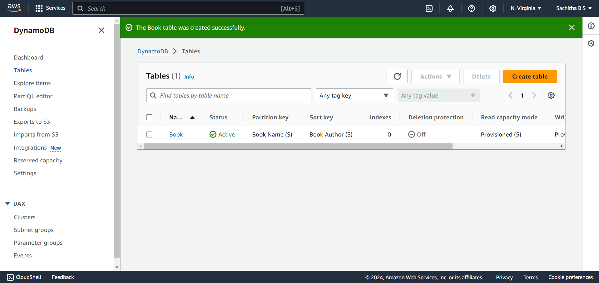
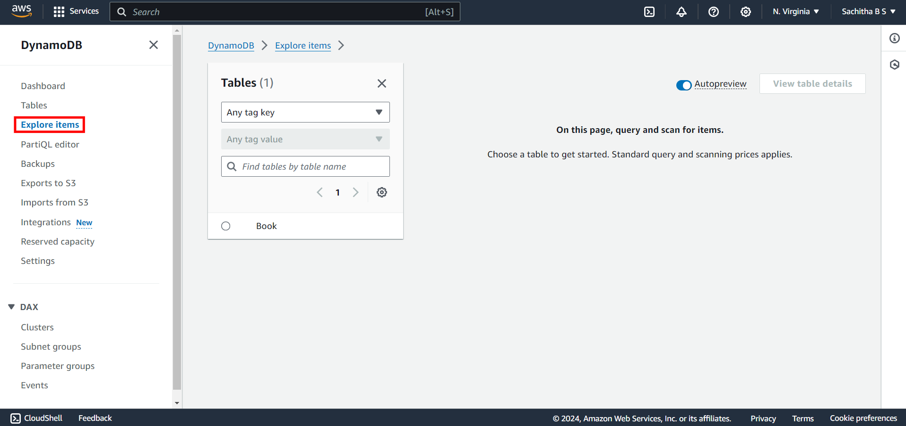
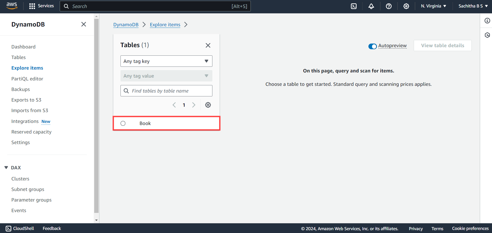
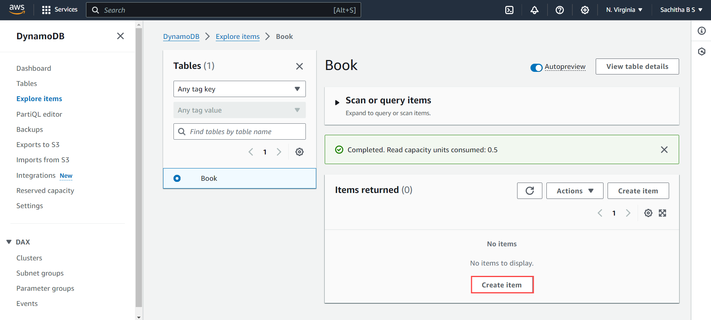
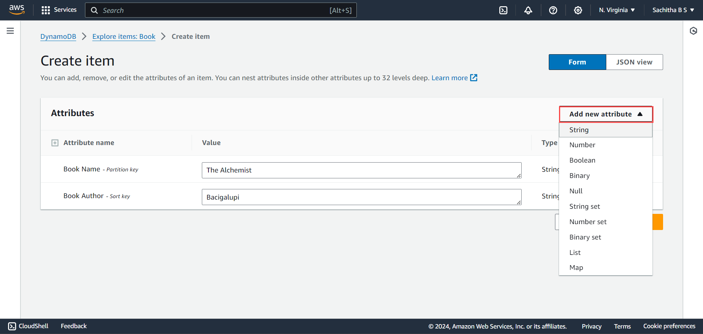

# **Exercise 2: Adding Items to the created table**
---
1. Once you have created the table you get to see that the table has been created and all its configurations can be seen as below

2. To Add the item ,Click on **Explore items** in the left navigation pane of console

3. On the **Tables Page**, Select the table created

4. In the **Items Returned Page**, Click on **Create Item**

5. You are now redirected to **Create Item** page, Enter the Attribute Values based on the type.
    - Book Name
    - Book Author

6. To add Additional Attribute apart from the Existing Attribute, Click on **Add New Item** where you need to first select the type of the attribute

7. Enter the Attribute name and its Type. Repeat the process to add more attribute as mentioned in **Step 6** 

8. Click on **Create Item** for adding the item into the table.

9. In **Items Returned** page one item will be inserted. To add additional items click on **Create Item** and Repeat the procedure.

<validation step="f85c9f35-901f-46e7-b8aa-c2c0507e784a" />
