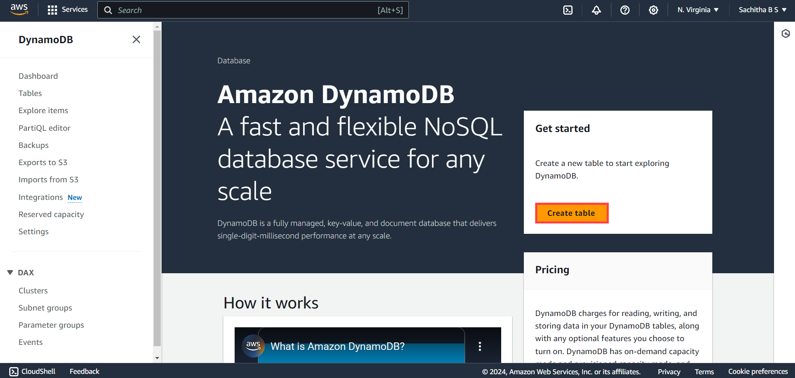
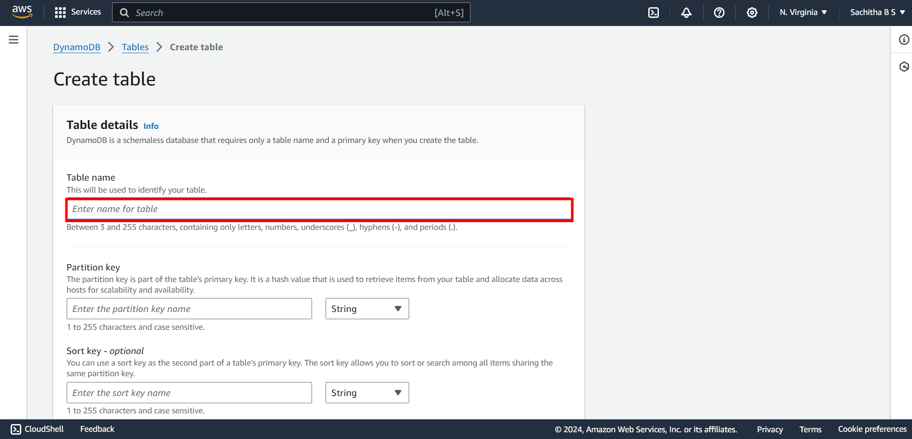
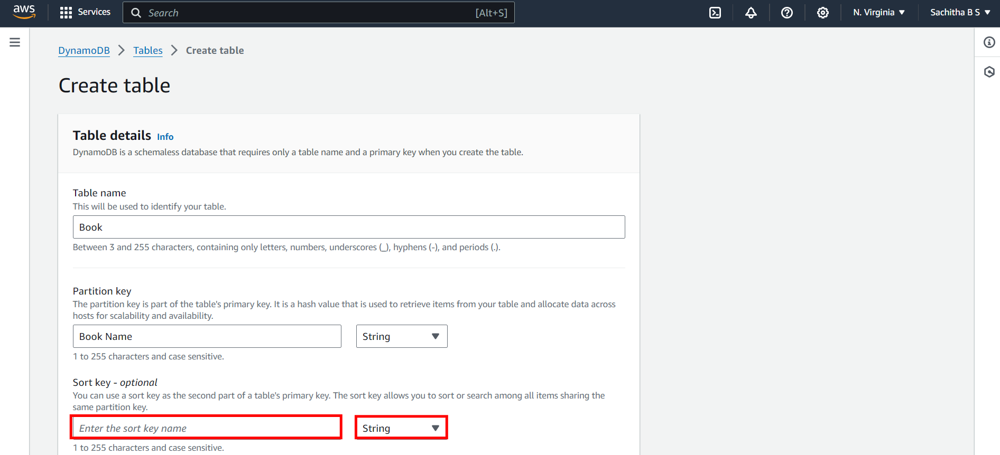

# **Exercise 1: Table Creation**
---
1. Once the Service is located you will be directed to the **DynamoDB** Homepage
2. In order to create Table click on **Create Table** as shown below

  

3. Specify the table details for creating the table. Enter the table name

  

4. Provide the partition key Name and its corresponding type .Type can be selected through the drop down 

 

5. Sort Key can also be utilized for creating primary key .But its optional unless you know the data in the partition key is not repeated. Provide the Sort key name and its corresponding type.

 

6. Under **Table Setting** Keep the default Settings

 

7. After Specifying the details, Scroll down and click on **Create Table**

 